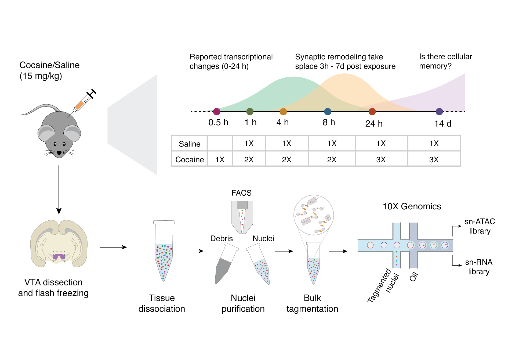
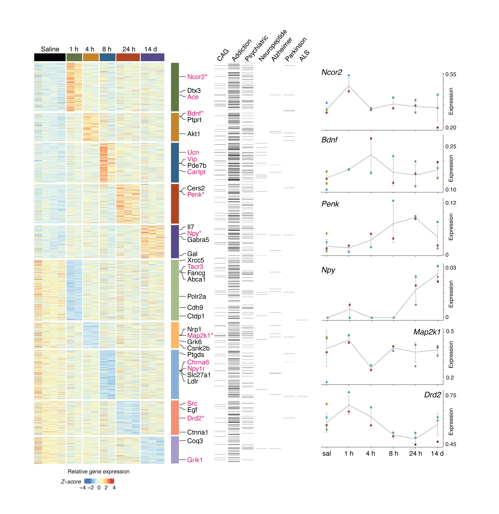
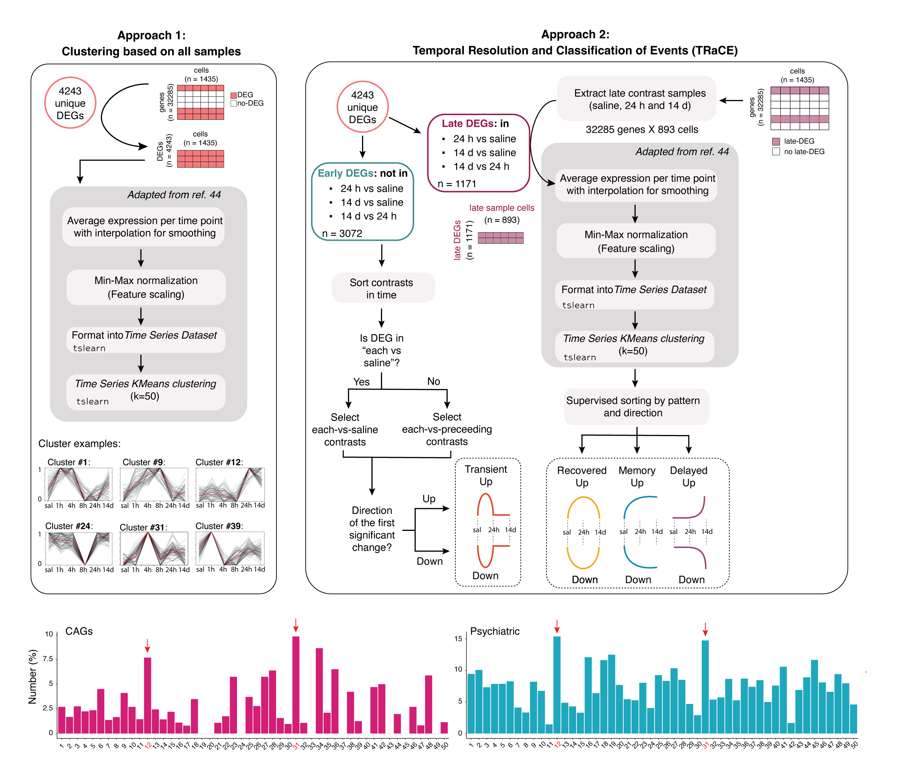
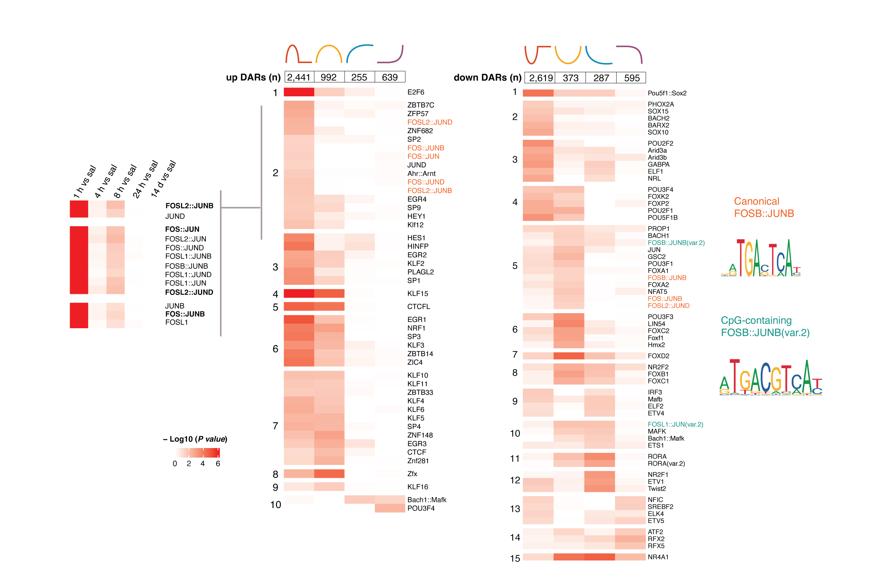
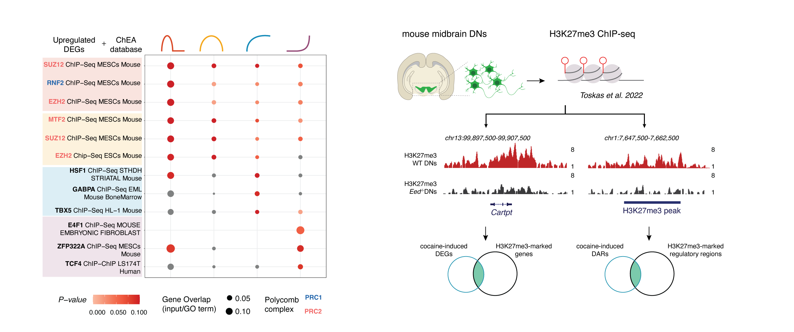
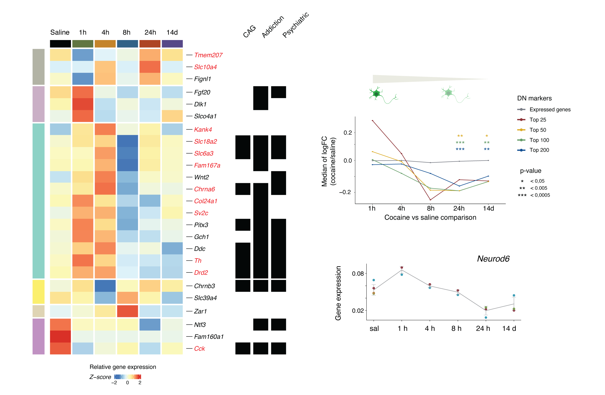

# Analysis of single-cell chromatin and transcriptional dynamics following drug exposure

Welcome! This GitHub repository is complementary to my PhD thesis and our manuscript (currently in preparation) exploring how a single exposure to cocaine alters chromatin accessibility and gene expression in dopamine neurons (DNs) over time. Using paired single-nucleus ATAC-seq and RNA-seq from the ventral tegmental area (VTA), we investigate the temporal dynamics of neuronal activation and long-term molecular memory.

All the figures in the manuscript and extended data can be reproduced using the scripts in this repository.

This repository contains code used for the analyses in the thesis and manuscript. It is shared for transparency and reproducibility. Please note that the code was developed for research purposes and is not intended to be production-ready or optimized for general use.

If you have any questions, comments, or suggestions for improvement, feel free to reach out by opening an issue.

## Overview of the repository

Currently, only the code is available (remaining folders will be populated following publication).

This repository contains the following folders:

- **`code`**: R scripts, bash scripts, and Jupyter Notebooks used for preprocessing, integration, and downstream analyses. 
- **`data`**: Processed input files required for the analysis. Raw data should be downloaded separately from GEO.
- **`figures`**: Empty by default; populated when scripts are executed. Stores generated figures for the manuscript and supplementary materials.
- **`results`**: Contains non-figure outputs such as gene lists, differential analysis results, motif enrichments, and cluster assignments.

## Summary of the project

### Overview  
Drugs of abuse hijack the brain’s reward circuitry, reinforcing drug-taking behavior and driving addiction. VTA-DNs are among the first to respond to cocaine exposure and play a central role in this process. While the effects of a single exposure are generally considered to be transient, it remains unclear whether a single cocaine dose can induce lasting gene regulatory changes. In this project, I investigated genome-wide changes in transcription and chromatin accessibility in VTA-DNs following a single cocaine exposure, using paired single-nucleus ATAC-seq and RNA-seq across immediate (0–8h), short-term (24h), and long-term (14d) time points.

  
   
  <em>Experimental design and sampling time points following single cocaine exposure</em>

### Transcriptional responses to cocaine exposure  
We observed that even a single exposure to cocaine is sufficient to induce widespread and long-lasting transcriptional changes in VTA DNs. In particular, genes that become upregulated are enriched for addiction-associated and psychiatric disorder–related genes, suggesting that early transcriptional activation may already engage pathways linked to long-term vulnerability. Several neuropeptides, including *Cartpt, Ucn, Penk,* and *Npy*, remain upregulated for up to two weeks, pointing to sustained alterations in neuronal signaling.

  
   
  <em>Gene expression changes in VTA-DNs from each vs. saline comparisons</em>

### Temporal gene expression dynamics
To capture how gene expression changes evolve over time, we applied two complementary approaches to structure temporal dynamics. First, we grouped all differentially expressed genes into clusters based on their expression trajectories, revealing diverse and coordinated temporal patterns following cocaine exposure. To improve interpretability, we then developed a simplified classification framework, TRaCE, which assigns genes into four categories: *Transient*, *Recovered*, *Memory*, and *Delayed*, based on when changes occur and whether they persist. This approach allows a clear distinction between short-term and long-lasting responses, highlighting that while many genes respond rapidly and return to baseline, a substantial subset exhibits sustained or delayed changes consistent with long-term molecular adaptation.

  
   
  <em>Workflow and classification of gene expression trajectories across time</em>

### Chromatin accessibility dynamics and transcription factor activity  
At the level of chromatin accessibility, dynamic changes over time point to distinct regulatory programs underlying these transcriptional responses. Regions that gain accessibility early after cocaine exposure are strongly enriched for AP-1 motifs and pioneer transcription factors, consistent with canonical activity-dependent chromatin remodeling. In contrast, later changes in accessibility are associated with transcription factors involved in oxidative stress regulation and synaptic remodeling. Regions that lose accessibility display more diverse patterns, including transient repression of activity-related motifs and longer-lasting reductions in factors linked to neuronal identity and plasticity, highlighting the complexity of regulatory repression mechanisms.

  
   
  <em>TF motif enrichment across dynamic chromatin accessibility classes</em>

### Disruption of Polycomb-mediated repression
Regions gaining accessibility are enriched for GC-rich sequences, particularly within Transient-, Recovered-, and Memory-Up DARs, suggesting that both early and persistent increases in chromatin accessibility are associated with CpG-rich regulatory elements. In contrast, regions with decreased accessibility exhibit more motif-specific patterns that are independent of GC content. To identify upstream regulatory mechanisms beyond chromatin accessibility, we performed enrichment analysis using the ChEA database, revealing a consistent overrepresentation of targets bound by PRC2 complex subunits among upregulated genes, with no such enrichment observed in downregulated genes. To further investigate this, we re-analyzed published H3K27me3 ChIP-seq data from in vivo midbrain DNs and found a significant positive association between H3K27me3 occupancy and gene upregulation following cocaine exposure. This relationship was also reflected at the chromatin level, as regions gaining accessibility were enriched for H3K27me3 marks. Together, these findings support a model in which cocaine exposure disrupts Polycomb-mediated repression, leading to the derepression of previously silenced genomic regions.

  
   
  <em>A single cocaine exposure induces long-lasting upregulation of Polycomb targets</em>

### Long-lasting downregulation of DN identity genes
Beyond global transcriptional changes, cocaine exposure also affects regulatory programs linked to neuronal identity. We observe a downregulation of genes associated with DN identity, which becomes most pronounced at 24h and remains evident up to 14 days after a single exposure. This is accompanied by reduced chromatin accessibility at binding sites of key identity transcription factors, such as FOXA1/2, suggesting a destabilization of the dopaminergic transcriptional program. Notably, downregulation of DN identity genes has been described as a feature of chronic cocaine exposure, indicating that even a single exposure may initiate molecular changes typically associated with prolonged drug use.

  
   
  <em>One cocaine exposure induces long-lasting downregulation of VTA-DN marker genes.</em>

### Conclusion  
Taken together, these findings demonstrate that a single cocaine exposure induces temporally structured transcriptional and epigenomic remodeling in VTA-DNs. The response appears to transition from rapid neuronal activation to more persistent regulatory adaptations, involving both chromatin remodeling and the disruption of repressive mechanisms, which may contribute to long-term vulnerability to addiction.
